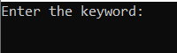
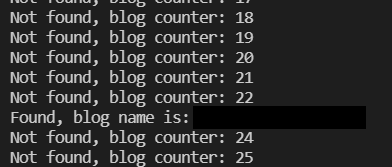
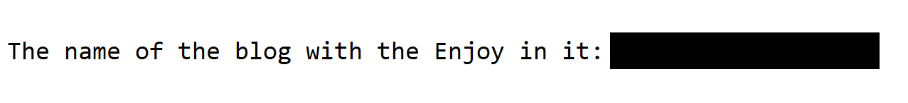

# Tumblr Keyword Scraper

Tumblr Keyword Scraper is a software created using BeautifulSoup and Requests that allows keyword searching within Tumblr blogs. On the other hand getLink made with Javascript and Love 🥰.

## Installation

To run this project first you have to install;
 - BeautifulSoup
 - Requests

and of course you need `keywordScrape.py` and `getLink.js`.

## Information

In order for Tumblr Keyword Scraper to find a blog that will search for keywords in blogs, a post link must be given in a list. You can do this in two ways;

 - You can manually copying and pasting urls of you choice. 
 -  (**Recommended**) You can use the `getLink.js` file, in order to use the `getLink.js` file you have to do these; 
		 
	 - First you have to login your Tumblr account because we are getting post links of you dashboard.
	 - Press `CTRL + SHIFT + I` or `Right Click and Inspect` and click on the "Sources" tab, click on the double greater than sign and click "Snippets", then you can click "New Snippets" and copy the code inside of the `getLink.js` and paste it in the snippets that you just created.
	 - Press `CTRL + Enter` to get all the links loaded on your screen in list.
	 
	 You should copy the list full of links and paste in the `Line 8 --> blogList[]` and that's it!

  
## Usage

When you done everything in the [Information](#information) section, run `keywordScrape.py` and you will see this screen;  

After entering the keyword you want to search in your blogs, press `Enter` and Tumblr Keyword Scraper is search that keyword in all the blogs that you give links. If it finds it, it will give an information message and save the name of the blog in the file named blogNameText.txt located in the same folder as keywordScrape.py.

> The blog name has been blackened for privacy.
